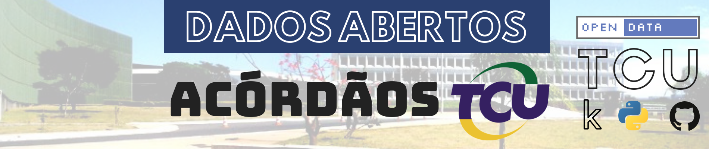

# Base de acórdãos do Tribunal de Contas da União

# 1. Fonte
## Os dados foram coletados do portal do [TCU](https://portal.tcu.gov.br/inicio/).

# 2. Metodologia
## A coleta ocorreu por meio de *web crawling*. O processo foi interativo e envolveu mais de uma abordagem. A primeira se deu pelo uso da biblioteca [Selenium](https://www.seleniumhq.org/) implementado pela classe `AcordaosTCU` localizada em `scripts.crawler`. O segundo *approach* foi feito pelo uso do [scrapy](https://scrapy.org/) por meio da classe `ApiSpider` localizado em `crawlers.projects.api_acordaos.apiacordao.apiacordao.spiders.api`.

# 3. Dados Abertos Publicados
## Os dados consolidados estão publicados na plataforma Kaggle. Estes dizem respeito aos acórdãos proferidos pelo TCU entre os anos de 1992 até 30/08/2019. O conteúdo está armazenado em um arquivo sqlite3 (.db) e possui aproximadamente 3.8GB.

